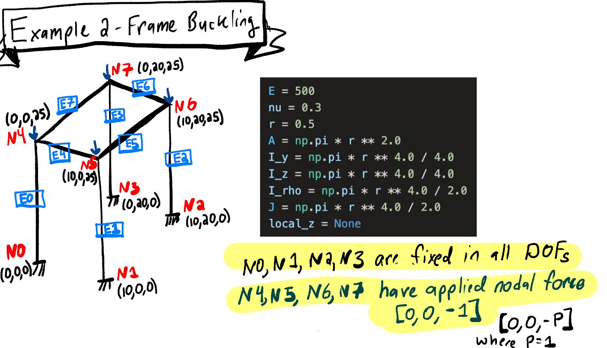
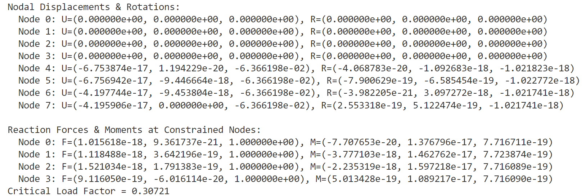
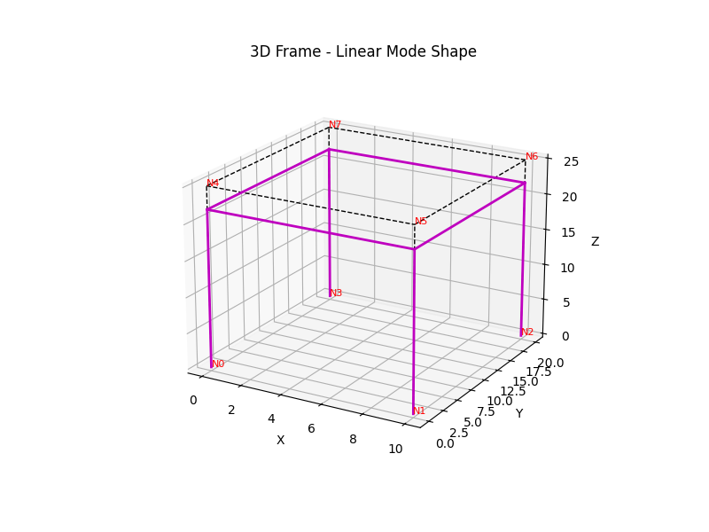
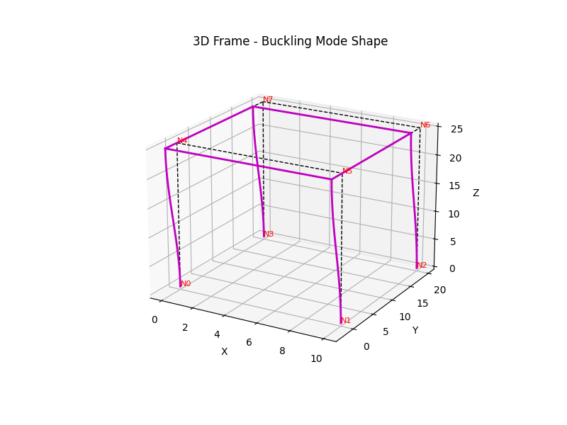

# Direct Stiffness Method Solver Tutorial

[](https://www.python.org/)
[](https://github.com/dmj-bu/ME700-Assignment-1)
[](https://github.com/dmj-bu/ME700-Assignment-1/blob/main/LICENSE)

[]((https://codecov.io/gh/dmj-bu/ME700-Assignment-1/tree/main/src%2FElasto_Plastic_Model))
[](https://github.com/dmj-bu/ME700-Assignment-2/actions/workflows/tests.yml)
---

## **Introduction**
This tutorial provides a step-by-step guide for analyzing a **3D frame structure** using a Python-based **Direct Stiffness Method solver with Post-processing and Elastic Critical Load Analysis**.

It covers:
- Defining frame geometry and properties
- Applying loads and boundary conditions
- Running the solver and interpreting results
- **Elastic Critical Load Analysis** for buckling evaluation
- **3D Visualization of Deformed Shapes**
- **Mathematical derivations for the stiffness formulation**
- **Instructions for modifying the code for different problems**

---

## **Installation & Usage**

### 1: Clone the Repository
```bash
git clone https://github.com/dmj-bu/ME700-Assignment-2.git
cd ME700-Assignment-2
```

### 2: Create and Activate Conda Environment
```bash
conda create --name me700-tutorial python=3.12
conda activate me700-tutorial
```

### 3: Install Dependencies
```bash
pip install -e .
```

### 4: Run the Tutorial
```bash
cd src/Critical_Load_Analysis
python criticalloadanalysis_tutorial.py
```

---
## **Example Problem Setup**
The tutorial is based on the **Example 2 - Frame Buckling** problem.

The example problem used in this tutorial is visualized below:



The figure shows the **node connectivity**, **boundary conditions**, and **applied loads** for the problem analyzed in `criticalloadanalysis_tutorial.py`.

---

## **Step 1: Defining the Frame Structure**

The **frame consists of eight nodes and eight beam elements**, forming a 3D rectangular structure. The structure is loaded with forces at the top nodes and is supported at the bottom nodes.

### **Node Definition**
```python
nodes = np.array([
    [0, 0, 0],    # N0
    [10, 0, 0],   # N1
    [10, 20, 0],  # N2
    [0, 20, 0],   # N3
    [0, 0, 25],   # N4
    [10, 0, 25],  # N5
    [10, 20, 25], # N6
    [0, 20, 25]   # N7
])
```

### **Material Properties**
```python
E = 500
nu = 0.3
r = 0.5
A  = np.pi * r**2
I_y = np.pi * r**4 / 4.0
I_z = np.pi * r**4 / 4.0
I_p = np.pi * r**4 / 2.0
J   = np.pi * r**4 / 2.0
```

### **Element Connectivity**
```python
connection = np.array([
    [0, 4, E, nu, A, I_y, I_z, I_p, J, [1,0,0]],
    [1, 5, E, nu, A, I_y, I_z, I_p, J, [1,0,0]],
    [2, 6, E, nu, A, I_y, I_z, I_p, J, [1,0,0]],
    [3, 7, E, nu, A, I_y, I_z, I_p, J, [1,0,0]],
    [4, 5, E, nu, A, I_y, I_z, I_p, J, [0,0,1]],
    [5, 6, E, nu, A, I_y, I_z, I_p, J, [0,0,1]],
    [6, 7, E, nu, A, I_y, I_z, I_p, J, [0,0,1]],
    [7, 4, E, nu, A, I_y, I_z, I_p, J, [0,0,1]]
], dtype=object)
```

---

## **Step 2: Applying Loads and Boundary Conditions**

### **Supports**
```python
supports = np.array([
    [0, 1,1,1, 1,1,1],
    [1, 1,1,1, 1,1,1],
    [2, 1,1,1, 1,1,1],
    [3, 1,1,1, 1,1,1],
    [4, 0,0,0, 0,0,0],
    [5, 0,0,0, 0,0,0],
    [6, 0,0,0, 0,0,0],
    [7, 0,0,0, 0,0,0]
])
```

### **Applied Nodal Forces**
```python
loads = np.zeros((8,6))
loads[4] = [0, 0, -1, 0, 0, 0]
loads[5] = [0, 0, -1, 0, 0, 0]
loads[6] = [0, 0, -1, 0, 0, 0]
loads[7] = [0, 0, -1, 0, 0, 0]
```

---

## **Step 3: Running the Solver**
```python
nodes, connection, loads, supports = get_problem_setup()
displacements, reactions = structure_solver(nodes, connection, loads, supports)
```

## **Step 4: Performing Elastic Critical Load Analysis**
```python
eigvals, eigvecs = critical_load_analysis(nodes, connection, loads, supports)
```

The first positive eigenvalue represents the **critical load factor** for buckling:
```python
lambda_crit = np.min(eigvals[eigvals > 1e-3])
```
### **Example Output:**

Computed Displacements and Rotations:


---

## **Step 5: 3D Visualization with `3d_grapher.py`**

### **Introduction**
`3d_grapher.py` is used to **visualize deformed shapes** of the frame in **linear or buckling mode**.

### **Usage**
Run the script in the terminal and specify which mode to visualize:
```bash
python 3d_grapher.py
```
When prompted, enter `linear` for static deformation or `buckling` for mode shape.

### **How it Works**
- Calls `criticalloadanalysis_tutorial.py` to extract displacements and eigenvalues.
- Uses **Hermite interpolation** for curved deformation.
- Plots both **undeformed (dashed black)** and **deformed (magenta)** structures.

### **Key Code Excerpts**
#### Extracting Analysis Results
```python
nodes, connection, disp_linear, disp_buckling, lambda_crit = extract_analysis_results()
```

#### Plotting 3D Deformed Structure
```python
plot_3d_displacements(mode_type="buckling", scale_factor=5)
```
### **Visualization of Deformed Shapes**
The results of the **linear analysis** and **buckling analysis** can be visualized using `3d_grapher.py`. Below are the corresponding plots:

#### **Linear Mode Shape (Deformed Structure - Static Loading Case)**


#### **Buckling Mode Shape (Deformed Structure - Buckling Case)**


These plots provide insight into **structural behavior under static and critical load conditions**. The **buckling mode shape** reveals how the structure deforms at the **critical load factor**, while the **linear mode shape** shows displacement under normal loading conditions.

---

## **Mathematical Background of the Direct Stiffness Method**

### **1. Local Stiffness Matrices**
Each beam element contributes a local stiffness matrix \( [k_e] \), which is derived from the governing differential equations of beam bending and axial deformation. The local stiffness matrix for a beam in three dimensions accounts for:
- Axial deformation
- Bending about two principal axes
- Torsion

The **axial stiffness component**:
$$
k_{axial} = \frac{EA}{L}
$$

The **bending stiffness components**:
$$
k_{bend,y} = \frac{12EI_y}{L^3}, \quad k_{bend,z} = \frac{12EI_z}{L^3}
$$

The **torsional stiffness component**:
$$
k_{torsion} = \frac{GJ}{L}
$$

Each element stiffness matrix is constructed using these values and organized into a **12×12 matrix** in local coordinates.

---

### **2. Transformation to Global Coordinates**
Each element has a local coordinate system aligned with its own axis. To assemble the structure in a global reference frame, a **rotation matrix** $ [T] $ is used to transform local stiffness matrices:
$$
[K]_g = [T]^T [k_e] [T]
$$
where $ [T] $ is the transformation matrix that accounts for the direction cosines of the beam’s local axes with respect to the global coordinate system.

This transformation ensures that each element's contribution aligns correctly in the overall system.

---

### **3. Assembling the Global Stiffness Matrix**
Once each element’s stiffness matrix is transformed into global coordinates, the **global stiffness matrix** $ [K] $ is assembled by summing the contributions of all elements at their respective degrees of freedom.

After assembling the global stiffness matrix, the system of equations is:
$$
[K] \{U\} = \{F\}
$$
where:
- $ [K] $ is the global stiffness matrix
- $ \{U\} $ is the nodal displacement vector
- $ \{F\} $ is the nodal force vector

To solve for displacements, boundary conditions are applied to remove dependent degrees of freedom.

---

### **4: Performing Elastic Critical Load Analysis**

The **elastic critical load analysis** determines the point at which a structure undergoes **buckling** by solving the eigenvalue problem:
$$
[K] U + \lambda [K_g] U = 0
$$
where:
- $ \lambda $ is the **buckling load factor**
- $ [K_g] $ is the **geometric stiffness matrix**, which accounts for axial forces in members affecting lateral stability

This equation is solved to obtain the **eigenvalues** ( $ \lambda_i $), where the smallest positive eigenvalue corresponds to the **critical load factor**. The associated **eigenvector** represents the **buckling mode shape**.

The geometric stiffness matrix is derived by considering how axial forces influence the stiffness of members:
$$
[K_g] = \sum_{elements} [T]^T [k_g] [T]
$$
where $ [k_g] $ represents the local geometric stiffness contribution due to axial loads.

---

### **5: Visualization with `3d_grapher.py`**

The `3d_grapher.py` script visualizes the deformation of the frame in **either static (linear) or buckling mode**.

### **How It Works**
1. Calls `criticalloadanalysis_tutorial.py` to retrieve:
   - Nodal displacements from linear analysis
   - Eigenvalues and eigenvectors from buckling analysis
2. Uses **Hermite interpolation** to visualize curved buckling deformations
3. Plots both **undeformed (dashed black)** and **deformed (magenta)** structures

### **Mathematical Background for Visualization**
The **Hermite interpolation** used to smooth deformed shapes follows:

$$
v(x) = (1-3t^2 + 2t^3)v_1 + (t - 2t^2 + t^3)\theta_1 + (3t^2 - 2t^3)v_2 + (-t^2 + t^3)\theta_2
$$

where $ t $ is a normalized coordinate along the beam length, and $ v_1, v_2 $ are the displacements at the beam ends.

---

## **Conclusion**
This tutorial provides a structured approach to solving **3D frame structures** using:
- The **Direct Stiffness Method** for linear elastic analysis
- **Geometric stiffness contributions** for buckling analysis
- **Eigenvalue analysis** to determine critical load factors
- **Hermite interpolation** for visualizing deformations

The provided scripts can be modified for different problems by adjusting the **geometry, material properties, boundary conditions, and applied loads**.

